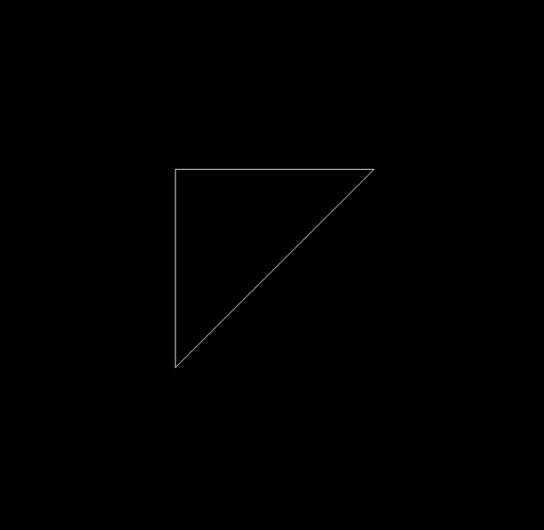
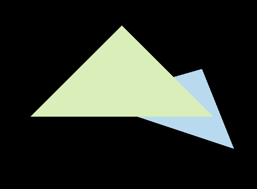

# Games101

## Introduction

- Introduction to Modern Computer Graphics, 2020, spring, Games101, taught by Lingqi Yan in UCSB

## HW

### HW0

- Basic Eigen Operations and implement a homogeneous transformation matrix, incluing rotation and translation.

### HW1

- Implement model transformation, and perspective transformation process.

### HW2

- Implement rasterization process and modify some settings in projection transformation.
