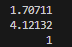
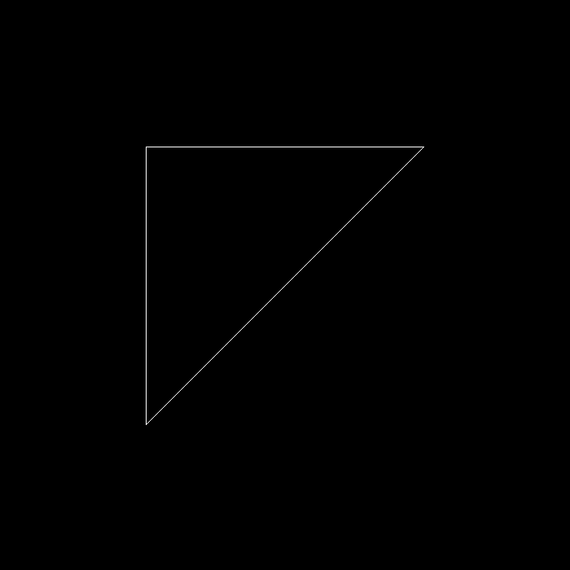
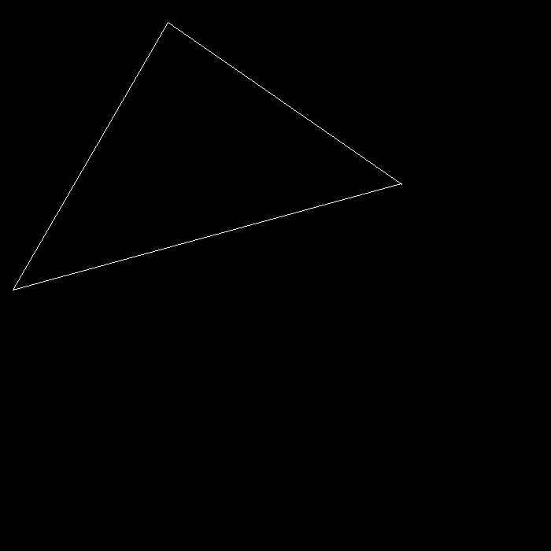
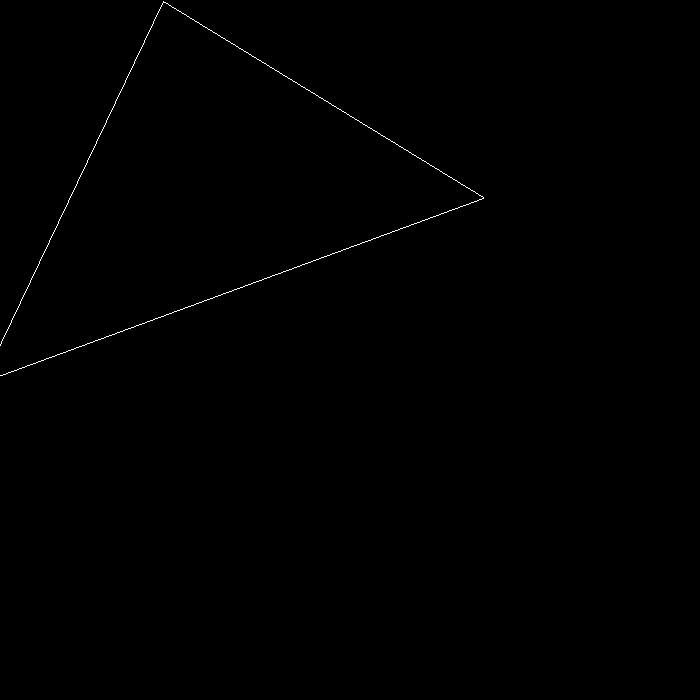
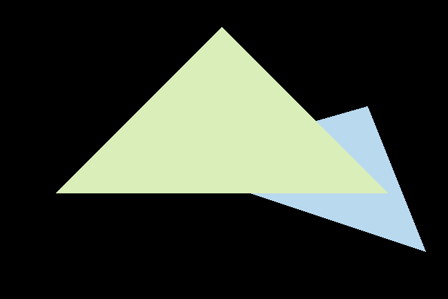
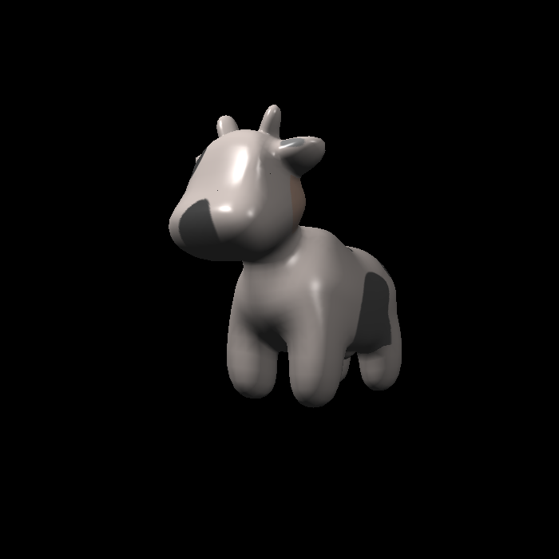
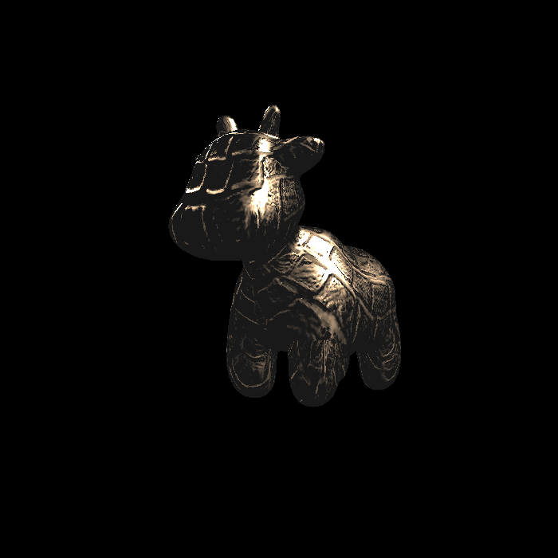
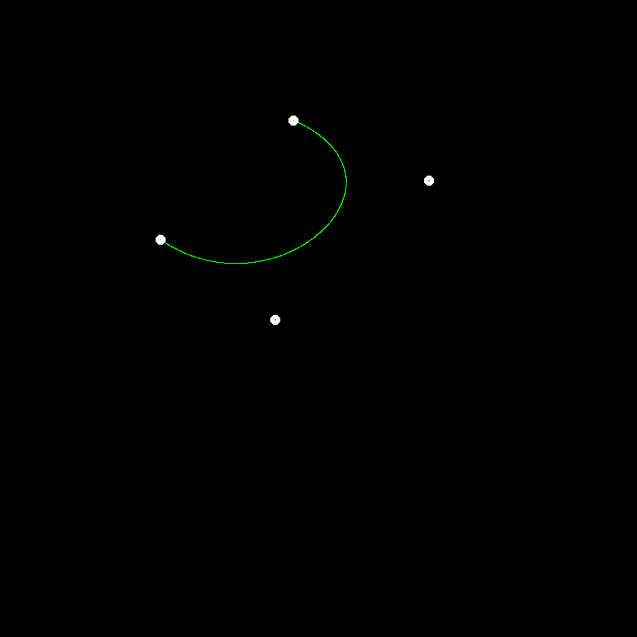

# Games101

## Introduction

- Introduction to Modern Computer Graphics, 2020, spring, Games101, taught by Lingqi Yan in UCSB

## HW

### HW0

- Basic Eigen Operations and implement a homogeneous transformation matrix, incluing rotation and translation.
- Transform result

  

### HW1

- Implement model transformation(on random axis), and perspective transformation process.
- Rotate on the axis (0,0,1)

    
- Rotate on the axis (1,1,1)

    

### HW2

- Implement rasterization process and modify some settings in projection transformation.
- Original result and Anti-aliasing result

    

## HW3

- Implement shading process, including blinn-phong, texture, bump, displacement fragment shaders. Also implement bilinear method to get texture color.
- Original result and Bilinear result

    
    
    
    
    

## HW5

- Implement de Casteljau algorithm to draw bezier curve and also an anti-version.
- Original result and anti-aliasing result

    