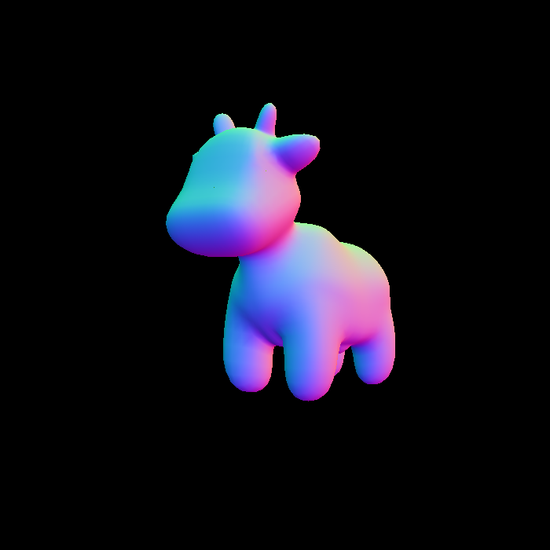
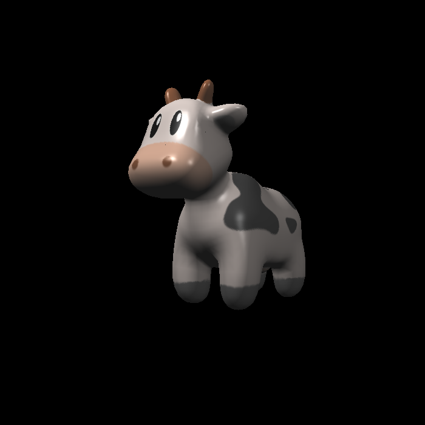
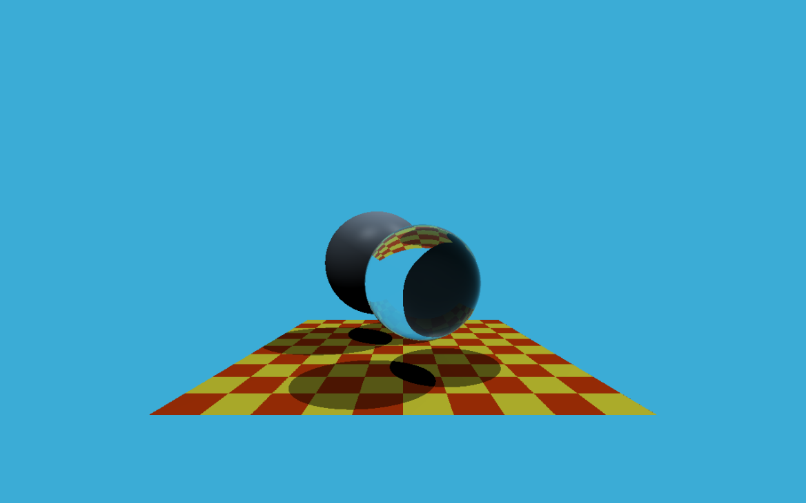
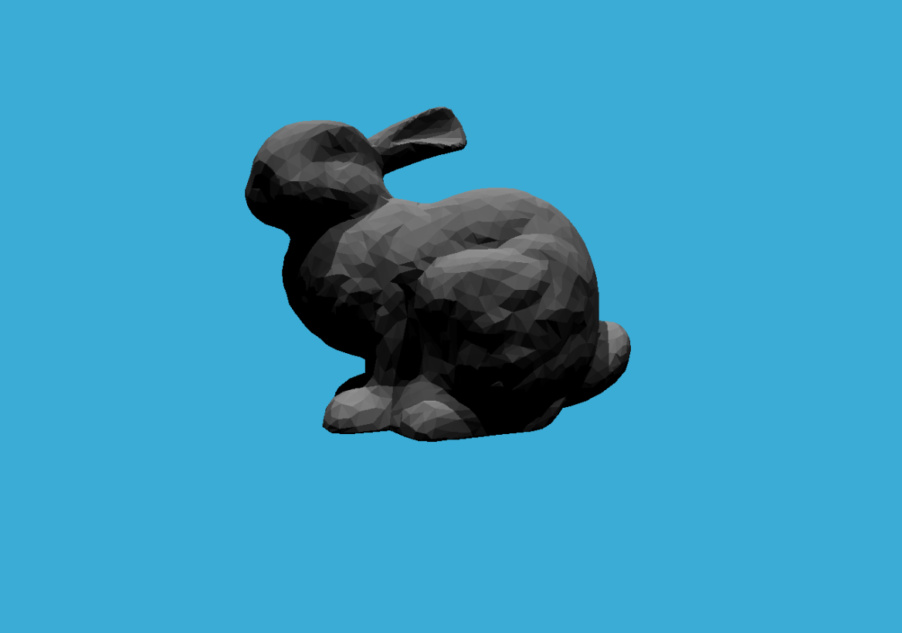
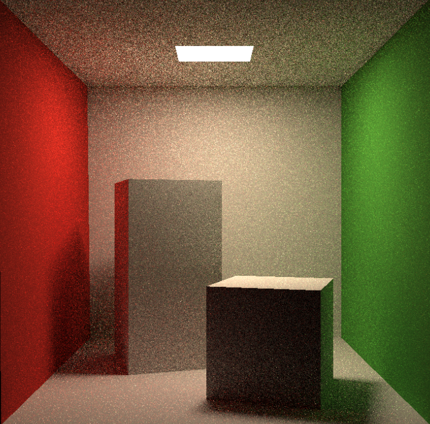
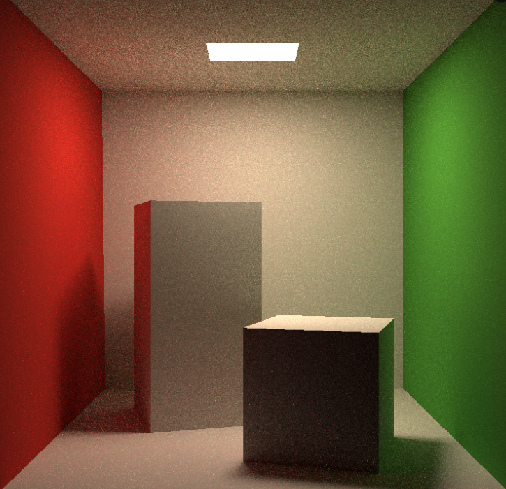

# Games101

## Introduction

- Introduction to Modern Computer Graphics, 2020, spring, Games101, taught by Lingqi Yan in UCSB

## HW

### How to run the code

First compile the code

```bash
cd code
mkdir build
cd build
cmake ..
make
```

Then you can use specific instructions to run the code, getting the result

### HW0

- Basic Eigen Operations and implement a homogeneous transformation matrix, incluing rotation and translation.
- Transform result

  

### HW1

- Implement model transformation(on random axis), and perspective transformation process.
- Rotate on the axis (0,0,1)

    
- Rotate on the axis (1,1,1)

    

### HW2

- Implement rasterization process and modify some settings in projection transformation.
- Original result and Anti-aliasing result

    <!--  -->
    

## HW3

- Implement shading process, including blinn-phong, texture, bump, displacement fragment shaders. Also implement bilinear method to get texture color.
- Original result and Bilinear result

    
    
    
    
    

## HW4

- Implement de Casteljau algorithm to draw bezier curve and also an anti-aliasing version.
- Original result and anti-aliasing result

    

## HW5

- Implement original whitted-style ray tracing process, including Ray generating process and Moller-Trumbore algorithm to determine whether ray intersect with triangle.
- Ray tracing result

    

## HW6

- Implement modified whitted-style ray tracing process, including AABB and BVH method to accelerate.
- Accelerated Ray tracing result

    

## HW7

- Implement path tracing process with multi-thread accelerating.
- different ssp result

    